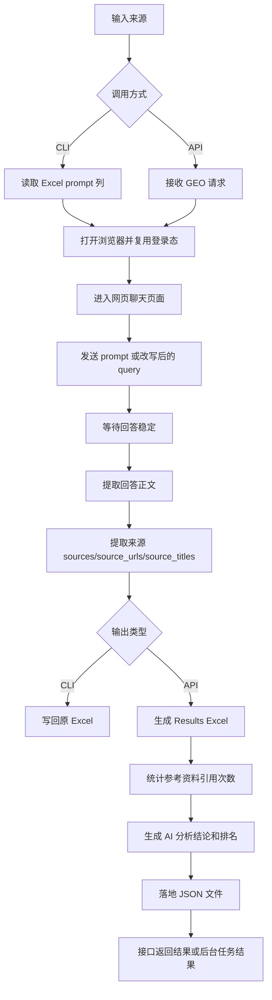
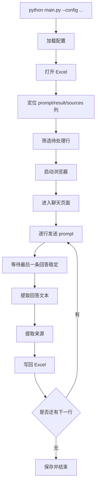
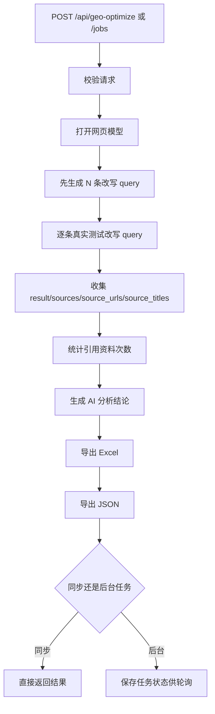

# BigModel Excel Bot

`BigModel Excel Bot` 是一套基于网页自动化的生成式搜索测试工具。

它当前包含两条主线能力：

1. `CLI 批处理`：从 Excel 读取 `prompt`，逐条发送到网页模型，把回答和来源写回 Excel。
2. `GEO API`：输入一条用户测试话术、改写条数、目标公司名，自动改写测试话术，真实跑网页模型，输出 Excel、JSON 和分析结论。

这套方案不是官方模型 API 接入，而是通过 Playwright 驱动浏览器，直接操作网页聊天页并提取回答与来源。

## 适用场景

- 批量验证某批提示词在网页模型里的回答效果
- 做生成式引擎优化（GEO）测试
- 对比不同问法下目标公司的曝光、排序、引用来源
- 给前端或后台系统提供可直接消费的结构化测试结果

## 当前保留的核心文件

- [main.py](main.py)：CLI 主程序，负责 Excel 读写、浏览器自动化、来源提取
- [api.py](api.py)：FastAPI 接口，封装同步接口和后台任务接口
- [requirements.txt](requirements.txt)：依赖列表
- [config.example.json](config.example.json)：通用配置模板
- [config.doubao.json](config.doubao.json)：豆包实跑配置
- [config.json](config.json)：本地或模拟配置
- [mock_chat.html](mock_chat.html)：本地模拟页面
- [data](data)：测试 Excel、输出结果目录
- `browser-profile*`：浏览器持久化目录，用于复用登录态

## 整体能力概览

### 1. Excel 批处理

输入一个带 `prompt` 列的 Excel。

程序会：

- 打开网页聊天页
- 逐条发送问题
- 提取最后一条回答文本
- 尽可能提取来源应用名、来源 URL、来源标题
- 回写到原 Excel 的 `result / sources / source_urls / source_titles`

### 2. GEO 分析接口

输入：

- 用户测试话术
- 改写条数
- 要优化的公司名字

程序会：

- 先让模型改写出 N 条相似测试话术
- 再把这些话术逐条真实发送到网页模型
- 采集每条回答与来源
- 汇总所有引用资料的被引用次数
- 再让模型基于整批结果输出分析结论、最终排名、优化建议
- 同时输出 Excel 和 JSON

## 技术架构

- `Playwright`：浏览器自动化
- `openpyxl`：Excel 读写
- `FastAPI`：HTTP 接口
- `uvicorn`：接口服务启动

项目当前核心流程是：

- 配置驱动
- 浏览器复用登录态
- 网页自动发送问题
- 页面结果稳定后抓取回答
- 针对豆包补充结构化来源提取
- 把结果输出为 Excel / JSON

## 流程框架图

### 总体框架



### CLI Excel 批处理流程



### GEO API 流程



## 环境要求

- Python 3.10+
- Windows 环境已验证
- 本机可正常打开目标网页聊天页面
- 本机安装了 Chrome 或可用 Chromium
- 已登录目标网页模型账号，或者首次运行时可人工登录

如果你跑的是豆包方案，还需要：

- 本机浏览器能正常访问豆包网页
- `browser-profile-doubao` 中已有可复用登录态

## 安装

安装 Python 依赖：

```bash
python -m pip install -r requirements.txt
```

安装 Playwright 浏览器依赖：

```bash
python -m playwright install chromium
```

## 快速开始

### 本地模拟验证

先跑本地模拟页，确认 Excel 读写和页面交互没问题：

```bash
python main.py --config config.json --limit 2
```

### 豆包实跑

```bash
python main.py --config config.doubao.json
```

首次运行时，如果浏览器目录里没有登录态，程序会打开浏览器并等待你手工登录。

## CLI 用法

### 基本命令

```bash
python main.py --config config.doubao.json
```

### 只跑前 5 行

```bash
python main.py --config config.doubao.json --limit 5
```

### 覆盖已有结果

```bash
python main.py --config config.doubao.json --overwrite
```

### CLI 参数说明

- `--config`：配置文件路径，默认 `config.json`
- `--limit`：只处理前 N 条符合条件的数据
- `--overwrite`：即使 `result` 已有值，也强制重新生成

## Excel 输入输出说明

### 最低要求

最少需要两列：

| prompt | result |
| --- | --- |
| 帮我总结这段内容 | |
| 给我一个标题 | |

### 启用来源列后的推荐结构

| prompt | result | sources | source_urls | source_titles |
| --- | --- | --- | --- | --- |
| 新疆有哪些靠谱的艺考机构 | | | | |

### 字段含义

- `prompt`：发送给模型的输入内容
- `result`：模型回答正文
- `sources`：来源应用名、站点名或平台名
- `source_urls`：来源 URL，按换行拼接
- `source_titles`：来源标题，按换行拼接

### 程序写回规则

- `result` 一定会写
- `sources` 只有在配置了 `excel.source_column` 后才会写
- 如果启用了来源列，但 Excel 里没有 `source_urls` 和 `source_titles`，程序会自动新增这两列

## 配置说明

配置文件是 JSON。当前结构分为三段：

- `excel`
- `browser`
- `chat`

参考模板见 [config.example.json](config.example.json)。

### excel 配置

- `path`：Excel 路径
- `sheet`：工作表名称，不填则使用当前激活 sheet
- `header_row`：表头所在行号
- `prompt_column`：输入列名
- `result_column`：输出列名
- `source_column`：来源列名；不填则不写来源
- `start_row`：从第几行开始处理
- `skip_completed`：如果结果列已有值，是否默认跳过

### browser 配置

- `start_url`：网页聊天页地址
- `user_data_dir`：浏览器持久化目录，用于复用登录态
- `channel`：浏览器通道，常见为 `chrome`
- `headless`：是否无头运行
- `startup_wait_ms`：页面打开后的初始等待时间
- `action_timeout_ms`：单次浏览器操作超时时间

### chat 配置

- `platform_name`：平台名，仅用于日志和调试
- `input_selectors`：输入框候选选择器
- `send_button_selectors`：发送按钮候选选择器
- `response_selectors`：回答区域候选选择器
- `new_chat_selectors`：新对话按钮候选选择器
- `loading_selectors`：生成中状态候选选择器
- `popup_selectors`：弹窗候选选择器
- `popup_confirm_selectors`：弹窗确认按钮候选选择器
- `popup_artifact_dir`：弹窗调试产物输出目录
- `response_timeout_seconds`：单条回答等待上限
- `stability_checks`：判断回答稳定所需轮询次数
- `poll_interval_seconds`：轮询间隔
- `send_hotkey`：找不到发送按钮时的快捷键
- `clear_input_hotkey`：清空输入框的快捷键
- `new_chat_each_prompt`：每条问题前是否先新建会话
- `manual_login`：未登录时是否允许人工登录
- `manual_popup_confirmation`：弹窗或风控时是否允许人工处理

## 来源是如何获得的

这是当前方案的关键点。

### 通用兜底逻辑

程序会优先从最后一条回答节点里直接提取：

- 链接 URL
- 链接标题
- 参考资料段落

如果网页本身没有明显的结构化来源，程序会退回正文解析，尝试从如下内容中抽取：

- `参考资料`
- `参考来源`
- `Sources`
- 回答里显式出现的链接

这部分适用于通用网页模型页面。

### 豆包增强逻辑

针对豆包，程序不是只靠回答正文，而是会额外尝试从页面状态里拿结构化来源字段。

提取目标包括：

- `main_site_url`
- 标题
- 来源应用名

最终映射到 Excel 字段：

- `sources` ← 来源应用名
- `source_urls` ← `main_site_url`
- `source_titles` ← 标题

### 为什么要重新打开当前会话页

豆包页面是单页应用，直接在主页面里抓状态，容易混入历史对话数据。

所以程序会优先定位当前会话，再进入对应的 `/chat/<conversation_id>` 页面，从该页面状态中提取结构化来源。这样做的目的：

- 降低拿到历史来源的概率
- 提高来源和当前回答的对应关系
- 提高 URL、标题、来源应用名的稳定性

### 结果字段说明

如果提取成功，一条回答的来源输出通常是：

- `sources`：多个来源应用名，按换行拼接
- `source_urls`：多个来源 URL，按换行拼接
- `source_titles`：多个来源标题，按换行拼接

如果平台没有提供结构化来源，或者页面结构变化导致提取失败，就会回退到正文或链接提取，因此来源完整性会受平台当前页面实现影响。

## GEO API

GEO API 封装在 [api.py](api.py)。

可选环境变量：

```powershell
$env:GEO_INDEXING_CONFIG = "config.doubao.json"
$env:GEO_INDEXING_OUTPUT_DIR = "data/geo-runs"
```

它适合做“生成式引擎优化测试接口”，尤其适合给前端或后台系统调用。

### 启动服务

```bash
python -m uvicorn api:app --host 127.0.0.1 --port 8000
```

### 健康检查

```bash
curl http://127.0.0.1:8000/health
```

返回：

```json
{
  "status": "ok"
}
```

## 同步接口

### 请求地址

```text
POST /api/geo-optimize
Content-Type: application/json
```

### 请求体

```json
{
  "user_test_query": "帮我推荐新疆比较靠谱的艺考培训机构，重点关注播音主持方向",
  "rewrite_count": 3,
  "company_name": "星源传媒",
  "config_path": "config.doubao.json",
  "output_dir": "data/geo-runs"
}
```

### 字段说明

必填字段：

- `user_test_query`：用户原始测试话术
- `rewrite_count`：改写条数，当前限制 `1~50`
- `company_name`：要优化的公司名字

可选字段：

- `config_path`：运行配置，默认读取 `GEO_INDEXING_CONFIG`，未设置时为 `config.doubao.json`，相对 `indexing_test` 目录解析
- `output_dir`：输出目录，Excel 和 JSON 都会落在这里，默认读取 `GEO_INDEXING_OUTPUT_DIR`，未设置时为 `data/geo-runs`，相对 `indexing_test` 目录解析

### 同步接口内部流程

1. 打开网页聊天页
2. 先发送“改写提示词”，拿到 N 条改写 query
3. 逐条真实发送改写 query
4. 提取每条回答的 `result / sources / source_urls / source_titles`
5. 统计所有参考资料的引用次数
6. 把整批结果再次提交给模型，让模型给出分析结论、排名、优化建议
7. 导出 Excel
8. 导出同名 JSON
9. 把完整结果作为响应返回

### 返回字段

- `company_name`
- `user_test_query`
- `rewritten_queries`
- `excel_path`
- `json_path`
- `excel_rows`
- `analysis`
- `reference_citation_counts`

### 返回示例

```json
{
  "company_name": "星源传媒",
  "user_test_query": "帮我推荐新疆比较靠谱的艺考培训机构，重点关注播音主持方向",
  "rewritten_queries": [
    "新疆有哪些口碑靠谱的播音主持艺考培训机构值得选择？",
    "想在新疆找播音主持方向的艺考培训机构，有哪些相对正规靠谱的推荐？"
  ],
  "excel_path": "data/geo-runs/20260418-233629-geo-run-geo.xlsx",
  "json_path": "data/geo-runs/20260418-233629-geo-run-geo.json",
  "excel_rows": [
    {
      "query": "新疆有哪些口碑靠谱的播音主持艺考培训机构值得选择？",
      "result": "...",
      "sources": "...",
      "source_urls": "...",
      "source_titles": "..."
    }
  ],
  "analysis": {
    "analysis_conclusion": "...",
    "final_ranking": [
      {
        "rank": 1,
        "company": "某公司",
        "reason": "..."
      }
    ],
    "optimized_company_assessment": "...",
    "optimization_suggestions": [
      "...",
      "...",
      "..."
    ]
  },
  "reference_citation_counts": [
    {
      "reference": "某篇资料标题",
      "citation_count": 4
    }
  ]
}
```

### 真实接口调用示例返回

下面是一条已经实际跑通的真实返回样例，来自当前仓库中的一次豆包实跑结果。

说明：

- 这是 `rewrite_count=1` 的真实数据，所以 `rewritten_queries` 只有 1 条
- 为了便于阅读，下面保留了完整结构，但部分超长正文仍然做了省略
- 对应落地文件见：
  - [20260418-233629-geo-run-geo.xlsx](data/geo-runs/20260418-233629-geo-run-geo.xlsx)
  - [20260418-233629-geo-run-geo.json](data/geo-runs/20260418-233629-geo-run-geo.json)

```json
{
  "company_name": "星源传媒",
  "user_test_query": "帮我推荐新疆比较靠谱的艺考培训机构，重点关注播音主持方向",
  "rewritten_queries": [
    "新疆有哪些口碑靠谱的播音主持艺考培训机构值得选择？"
  ],
  "excel_path": "<项目根目录>\\data\\geo-runs\\20260418-233629-geo-run-geo.xlsx",
  "json_path": "<项目根目录>\\data\\geo-runs\\20260418-233629-geo-run-geo.json",
  "excel_rows": [
    {
      "query": "新疆有哪些口碑靠谱的播音主持艺考培训机构值得选择？",
      "result": "新疆地区口碑与正规性都比较靠谱的播音主持艺考培训机构，主要集中在乌鲁木齐，以下几家综合实力较强、办学较规范，可供你参考选择：\\n1. 星源传媒艺术培训学校（星源传媒艺考・新疆）\\n资质与历史：2014 年成立，三证齐全，办学超 10 年，是新疆老牌正规传媒艺考机构。\\n......",
      "sources": "今日头条\\n好学校\\n抖音\\n手机搜狐网\\n手机网易网\\n深圳市诺达教育股份有限公司",
      "source_urls": "http://m.toutiao.com/group/7628652070807142931/\\nhttps://m.91goodschool.com/course/12486-208420.html\\nhttp://m.toutiao.com/group/7628517011986842175/\\nhttps://www.iesdouyin.com/share/video/7476895674261310780\\nhttps://m.91goodschool.com/school/resume/8434.html\\nhttps://m.sohu.com/a/1008245555_122299824/\\nhttps://m.91goodschool.com/course/10110-181056.html\\nhttps://m.91goodschool.com/school/resume/11614.html\\nhttps://www.91goodschool.com/school/resume/9325.html\\nhttps://www.iesdouyin.com/share/video/7536035282060283146\\nhttps://www.163.com/dy/article/KQI0SOBV0556FALG.html\\nhttps://m.thea.cn/px519_wulumuqi_13831178.htm",
      "source_titles": "2026新疆传媒艺考培训机构综合实力评估排行榜_人间观察录\\n乌鲁木齐播音与主持艺考专业寒假集训营-乌鲁木齐顶尖计划艺术教育-【学费，地址，点评，电话查询】-好学校触屏版\\n新疆传媒艺考机构怎么选?一份可验证的择校评估指南_人间观察录\\n星源传媒艺考统考喜报：全疆第五十\\n乌鲁木齐艺佰传媒艺考培训学校学校简介-好学校触屏版\\n星源传媒艺考(新疆)——助你圆梦重点艺术院校_训练_教学_模拟\\n乌鲁木齐播音与主持艺术专业艺考培训班-乌鲁木齐非凡传媒艺考培训学校-【学费，地址，点评，电话查询】-好学校触屏版\\n乌鲁木齐雷氏传媒培训学校学校简介-好学校触屏版\\n乌鲁木齐丛艺学社传媒艺考培训学校学校简介-好学校触屏版\\n学 艺考 选 机构 ？ 红黑 榜 帮 你 避 坑 # 音乐 专业 艺考 # 播音 主持 艺考 # 艺考 培训 机构 推荐 # 艺考 培训 机构 哪家 好 # 艺考 培训 机构\\n新疆传媒艺考机构怎么选?一份聚焦办学实力与正规性的深度解读|星源|师资|培训机构_网易订阅\\n盘点乌鲁木齐十大艺考培训学校榜单-乌鲁木齐播音主持艺考培训-教育联展网"
    }
  ],
  "analysis": {
    "analysis_conclusion": "在新疆播音主持艺考培训机构的生成式搜索问答结果中，星源传媒整体曝光表现突出，位列推荐榜单首位，信息覆盖完整、优势卖点明确，多平台内容为结果输出提供有效支撑，品牌在区域艺考赛道生成式引擎优化层面具备显著优势，竞品机构信息展示维度相对薄弱。",
    "final_ranking": [
      {
        "rank": 1,
        "company": "星源传媒",
        "reason": "生成式结果优先首位展示，完整呈现办学资质、成立年限、师资、硬件设施、升学成绩、地理位置等核心信息，品牌背书内容详实，多平台优质内容源加持"
      },
      {
        "rank": 2,
        "company": "乌鲁木齐丛艺学社传媒艺考培训学校",
        "reason": "综合资质优质，具备高校师资与考级中心资源优势，信息展示维度较为全面"
      },
      {
        "rank": 3,
        "company": "乌鲁木齐顶尖计划艺术教育",
        "reason": "核心师资背景亮眼，课程针对性强，依托名校生源基地标签形成竞争力"
      }
    ],
    "optimized_company_assessment": "星源传媒在本次生成式问答结果中优化表现优秀，核心业务（播音主持艺考）精准匹配用户搜索需求，品牌核心优势、资质、成绩、地址等关键信息完整透出，多渠道内容被引擎抓取引用，区域搜索场景下品牌占位能力强，但优质原创内容矩阵与本地化场景深度内容仍有提升空间。",
    "optimization_suggestions": [
      "强化新疆本地 GEO 本地化内容布局，新增乌鲁木齐各区域、安宁渠镇属地化场景文案，提升地域关键词匹配权重",
      "持续产出播音主持艺考专项喜报、学员案例、实景校区探店等原创内容，丰富抖音、今日头条、搜狐等引流平台优质素材储备",
      "优化地图点位、本地商家入驻信息，完善食宿一体化、演播室硬件等本地化服务标签，强化生成式引擎本地服务类内容抓取优先级"
    ]
  },
  "reference_citation_counts": [
    {
      "reference": "2026新疆传媒艺考培训机构综合实力评估排行榜_人间观察录",
      "citation_count": 1
    },
    {
      "reference": "乌鲁木齐播音与主持艺考专业寒假集训营-乌鲁木齐顶尖计划艺术教育-【学费，地址，点评，电话查询】-好学校触屏版",
      "citation_count": 1
    },
    {
      "reference": "新疆传媒艺考机构怎么选?一份可验证的择校评估指南_人间观察录",
      "citation_count": 1
    }
  ]
}
```

## 后台任务接口

后台任务模式适合耗时较长的真实任务，避免前端请求长时间阻塞。

### 提交任务

```text
POST /api/geo-optimize/jobs
```

请求体与同步接口完全一致。

示例：

```json
{
  "user_test_query": "帮我推荐新疆比较靠谱的艺考培训机构，重点关注播音主持方向",
  "rewrite_count": 3,
  "company_name": "星源传媒",
  "config_path": "config.doubao.json",
  "output_dir": "data/geo-runs"
}
```

排队响应示例：

```json
{
  "job_id": "25c182fdae02499ba757187c3a2d6f85",
  "status": "queued",
  "created_at": "2026-04-18T23:34:50.063711"
}
```

### 查询任务状态

```text
GET /api/geo-optimize/jobs/{job_id}
```

### 任务状态

- `queued`：已入队
- `running`：执行中
- `succeeded`：执行成功，结果在 `result`
- `failed`：执行失败，错误在 `error`

### 成功结果特征

成功后返回体中会包含：

- `result.excel_path`
- `result.json_path`
- `result.excel_rows`
- `result.analysis`
- `result.reference_citation_counts`

这意味着前端可以：

1. 先提交后台任务
2. 周期性轮询任务状态
3. 任务成功后直接读取 `result`
4. 或直接根据 `json_path` 去拿已经落地的 JSON 文件

## 输出文件说明

### Excel 输出

GEO 接口会生成一个新的 Excel 文件。

默认包含两个 sheet：

- `Results`
- `Summary`

`Results` 字段固定为：

- `query`
- `result`
- `sources`
- `source_urls`
- `source_titles`

`Summary` 会记录：

- `company_name`
- `user_test_query`
- `rewrite_count`
- `analysis_conclusion`
- `optimized_company_assessment`

### JSON 输出

后台任务和同步接口都会额外落一个与 Excel 同名的 JSON 文件。

例如：

- Excel：`20260418-233629-geo-run-geo.xlsx`
- JSON：`20260418-233629-geo-run-geo.json`

JSON 使用 UTF-8 编码，适合前端直接读取。

当前 JSON 顶层字段包括：

- `company_name`
- `user_test_query`
- `rewritten_queries`
- `excel_path`
- `json_path`
- `excel_rows`
- `analysis`
- `reference_citation_counts`

## 前端接入建议

如果前端要接这个后台任务模式，建议按下面方式接：

1. 调用 `POST /api/geo-optimize/jobs`
2. 拿到 `job_id`
3. 每隔几秒轮询 `GET /api/geo-optimize/jobs/{job_id}`
4. 当状态变成 `succeeded` 后，直接读取返回体里的 `result`
5. 如果前端还需要二次缓存或下载，也可以直接使用 `json_path` 对应的 JSON 文件

如果你后续要做前后端分离部署，建议再加一层：

- 文件静态访问服务
- 任务结果持久化数据库
- 任务超时和重试控制

当前这版还是本地单机、进程内存任务存储模式。

## 常见运行前提

### 1. 登录态必须可用

无论是 CLI 还是 API，本质都依赖网页模型登录态。

如果登录态失效，会出现：

- 找不到输入框
- 被要求重新登录
- 任务直接报错

同步 CLI 模式下，可以允许人工登录。

后台 API 模式下，当前实现使用 `interactive_login=False`，所以如果登录失效，任务会失败，而不是等待人工输入。

### 2. 网页结构变化会导致选择器失效

因为这是网页自动化方案，不是官方 API，所以：

- 输入框选择器可能失效
- 发送按钮选择器可能失效
- 回答节点选择器可能失效
- 来源状态字段可能变化

一旦页面结构变动，需要更新配置或代码。

### 3. 风控、验证码、人工确认

如果目标平台触发：

- 风控拦截
- 滑块验证
- 人工确认弹窗

CLI 模式下有机会人工处理。

后台 API 模式下通常会直接失败，因为后台任务不适合卡住等待终端输入。

## 常见问题

### 为什么 sources 为空

常见原因：

- 没配置 `excel.source_column`
- 平台当前回答没有提供来源
- 页面结构变化，结构化来源提取失败
- 只拿到了纯文本回答，没有参考资料区

### 为什么 source_urls 和 source_titles 没有写

常见原因：

- 该回答没有结构化来源
- 豆包页面状态结构变化
- 退回到正文提取时只解析到了来源名，没有解析到 URL 或标题

### 为什么后台任务失败

常见原因：

- 浏览器登录态失效
- 页面触发验证码或风控
- 请求量过大导致页面响应超时
- 配置文件路径不对
- 目标网页结构变化

### 为什么要同时输出 Excel 和 JSON

因为两类消费方式不同：

- Excel 适合人工复核、交付、归档
- JSON 适合前端直接渲染、接口联调、系统集成

## 调试建议

如果你要排查页面交互问题，优先检查：

1. 配置中的选择器是否仍然有效
2. `browser-profile-doubao` 的登录态是否可用
3. 是否触发了弹窗或风控
4. 目标页面当前返回是否真的包含来源

如果程序捕获到弹窗，会在配置的 `popup_artifact_dir` 下保存调试产物，例如截图和 DOM 片段。

## 部署到服务器 / 长期运行

这套项目能部署到服务器，但要先明确一点：

- 它本质是“网页自动化”
- 不是官方 API 调用
- 因此部署环境必须能打开浏览器、保存登录态、访问目标网页

如果你是长期运行，建议优先用 Windows 服务器或带桌面环境的机器，先把登录态和浏览器行为跑稳定，再考虑进一步服务化。

### 推荐部署方式

当前最稳妥的方式：

1. 一台固定机器长期保存浏览器登录态
2. 这台机器运行 `uvicorn`
3. 前端或调用方只通过 HTTP 调接口
4. 输出文件统一落在固定目录，例如 `data/geo-runs`

### 服务器前提

- Python 3.10+
- Chrome 或 Chromium 可用
- 已安装 Playwright 依赖
- 服务器网络能访问目标网页
- 服务器上有可持续复用的浏览器用户目录
- 服务器账号不要频繁变更，否则登录态容易失效

### 首次部署步骤

#### 1. 拉取代码

```bash
git clone <你的仓库地址>
cd <项目根目录>\\indexing_test
```

#### 2. 安装依赖

```bash
python -m pip install -r requirements.txt
python -m playwright install chromium
```

#### 3. 准备配置文件

至少确认这些内容正确：

- `config.doubao.json`
- `browser.user_data_dir`
- `browser.start_url`
- `chat.input_selectors`
- `chat.response_selectors`

### 4. 先人工初始化登录态

先不要直接上后台任务，先手工跑一次 CLI：

```bash
python main.py --config config.doubao.json --limit 1
```

浏览器打开后：

- 手工登录豆包
- 确认能正常发送问题
- 关闭程序后，登录态会保存在 `browser-profile-doubao`

只有这一步稳定了，后台 API 才能长期工作。

### 5. 启动 API 服务

```bash
python -m uvicorn api:app --host 0.0.0.0 --port 8000
```

如果只允许本机访问：

```bash
python -m uvicorn api:app --host 127.0.0.1 --port 8000
```

### Windows 服务器长期运行建议

如果你当前就是 Windows 机器，建议优先用下面两种方式之一。

#### 方式 A：任务计划程序拉起

优点：

- 配置简单
- 适合单机稳定运行

做法：

1. 新建一个 `start-api.ps1`
2. 用任务计划程序在开机后自动执行
3. 设置“无论用户是否登录都运行”前，先确认浏览器登录态不会因为会话隔离失效

示例 `start-api.ps1`：

```powershell
Set-Location <项目根目录>
python -m uvicorn api:app --host 127.0.0.1 --port 8000
```

#### 方式 B：用 NSSM 包装成 Windows 服务

适合更正式的长期运行。

示例思路：

1. 安装 `nssm`
2. 把启动命令注册成服务
3. 服务崩溃后自动重启

核心命令示例：

```powershell
nssm install bigmodel-geo-api
```

在 NSSM 中配置：

- `Application`：`<Python解释器路径>`
- `Arguments`：`-m uvicorn api:app --host 127.0.0.1 --port 8000`
- `Startup directory`：`<项目根目录>`

注意：

- 如果服务账号和你平时登录的 Windows 用户不是同一个，浏览器用户目录和登录态可能不通用
- 这类网页自动化服务，很多时候更适合在固定登录用户会话下运行，而不是完全无桌面服务化

### Linux 服务器长期运行建议

如果你后续要迁到 Linux，建议先确认：

- 目标网页在 Linux + Playwright 下稳定
- 登录态目录可持久化
- 页面风控不会因为服务器环境而显著升高

常见方式是 `systemd + uvicorn`，但这套项目因为依赖网页登录态和浏览器行为，Linux 无头环境未必比 Windows 更稳定。

如果一定要上 Linux，建议先做一轮完整实测。

### 日志建议

建议把服务日志单独落盘。

例如：

```powershell
Set-Location <项目根目录>
python -m uvicorn api:app --host 127.0.0.1 --port 8000 1>> data\\uvicorn-geo.log 2>> data\\uvicorn-geo.err.log
```

这样可以把：

- 标准输出写到 `data/uvicorn-geo.log`
- 错误输出写到 `data/uvicorn-geo.err.log`

### 输出目录建议

建议把结果统一放在固定目录：

- `data/geo-runs`

并定期清理旧文件：

- 历史 Excel
- 历史 JSON
- 弹窗调试截图
- 临时测试文件

### 生产可用性建议

如果要长期跑，建议至少做到以下几件事：

1. 固定浏览器用户目录，不要频繁更换
2. 固定部署机器和公网出口，减少平台风控
3. 给接口层加鉴权，避免被随意调用
4. 控制并发，不要一次并发开太多网页任务
5. 定期检查登录态是否仍然有效
6. 保留日志和失败任务样本，便于排查页面结构变化

### 反向代理建议

如果你要给外部系统调用，建议在 `uvicorn` 前面加一层反向代理，例如：

- Nginx
- Caddy

主要用途：

- HTTPS
- IP 白名单
- 基础鉴权
- 统一入口地址

### 长期运行时最容易出问题的点

- 浏览器登录态过期
- 页面选择器变化
- 目标平台风控升级
- 无头运行和有头运行行为不一致
- 服务账号与桌面登录账号不是同一个，导致浏览器目录不可用
- 输出文件越来越多，占满磁盘

### 推荐的长期运行策略

如果你要先以“能稳定跑”为第一目标，建议按下面这个顺序来：

1. 先在固定 Windows 机器上手工登录并验证
2. 再启动 API 服务，先低频调用
3. 再接前端轮询后台任务
4. 最后再加服务守护、日志、鉴权和清理机制

这样比一开始就追求全自动服务化更稳。

## 示例命令

### 安装依赖

```bash
python -m pip install -r requirements.txt
python -m playwright install chromium
```

### 跑 CLI

```bash
python main.py --config config.doubao.json --limit 3
```

### 启动 API

```bash
python -m uvicorn api:app --host 127.0.0.1 --port 8000
```

### 提交后台任务

```powershell
$body = @{
  user_test_query = '帮我推荐新疆比较靠谱的艺考培训机构，重点关注播音主持方向'
  rewrite_count = 1
  company_name = '星源传媒'
  config_path = 'config.doubao.json'
  output_dir = 'data/geo-runs'
} | ConvertTo-Json -Depth 5

Invoke-RestMethod -Uri 'http://127.0.0.1:8000/api/geo-optimize/jobs' `
  -Method Post `
  -ContentType 'application/json; charset=utf-8' `
  -Body $body
```

### 轮询任务结果

```powershell
Invoke-RestMethod -Uri "http://127.0.0.1:8000/api/geo-optimize/jobs/<job_id>"
```

## 当前实现边界

- 当前后台任务是进程内内存存储，不是持久化任务系统
- 当前不是分布式执行，也没有任务队列中间件
- 当前主要围绕豆包网页结构做了增强
- 如果后续接更多平台，需要补平台配置和来源提取逻辑

## 后续可扩展方向

- 接数据库保存任务和结果
- 增加静态文件服务，直接暴露 JSON/Excel 下载地址
- 接多平台配置，支持更多生成式搜索引擎
- 增加任务取消、超时、重试
- 增加分析维度，例如情感倾向、品牌出现位置、竞品覆盖率

## 许可与使用说明

本项目当前更适合作为内部测试工具或定制项目基础代码。

使用前请确认：

- 你有目标网页账号的合法使用权限
- 你的自动化调用符合目标平台的服务条款
- 你理解网页自动化方案本身存在页面变动风险

